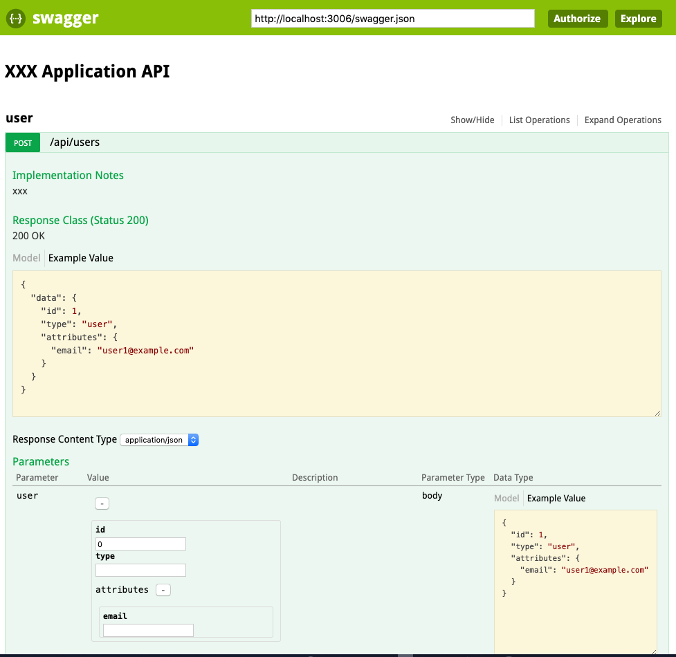

### This shell script to config swagger for Rails App

### Things to do
- Step 1: ./config_swagger.sh /folder/rails
- Step 2: bundle install
- Step 3: bundle exec rails s -p 3000 -b 0.0.0.0
- Step 4: Link to http://localhost:3000/api_docs/swagger_docs/v1
- Step 5: Take a coffee

### Images

